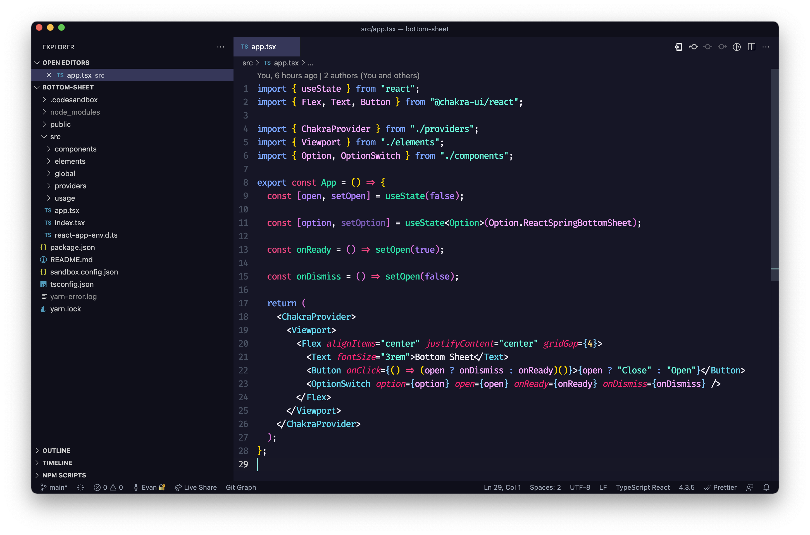

# VS Code Gloom

A darker and glamer pastel color syntax theme for VS Code.

Ported from [@RusinovAnton](https://github.com/RusinovAnton) VSCode [gloom glam](https://github.com/RusinovAnton/gloom-glam) ported from [@hejrobin's](https://github.com/hejrobin) Atom [gloom](https://github.com/RusinovAnton/gloom-glam).

---

# Changelog
[CHANGELOG.md](CHANGELOG.md)
